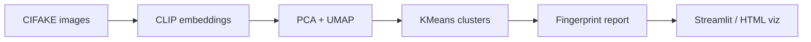

# AI Fingerprint Tracker
made by: Sanchit Kaushik | email: sk010us@gmail.com

Discover, cluster, and visualize **visual fingerprints** of AI-generated images. This project uses frozen [CLIP](https://github.com/mlfoundations/open_clip) embeddings on the [CIFAKE](https://www.kaggle.com/datasets/birdy654/cifake-real-and-ai-generated-synthetic-images) dataset, then groups images into clusters that reveal distinct generation artifacts (spectral ringing, checkerboard upsampling, smooth gradients, and more).

**Repository:** [github.com/Sanchit257/image_diff](https://github.com/Sanchit257/image_diff)

---

## Features

- **CLIP ViT-B/32 embeddings** — frozen visual features, no fine-tuning required
- **Unsupervised clustering** — PCA → UMAP → KMeans (with HDBSCAN evaluation)
- **Fingerprint interpretation** — per-cluster average images, FFT magnitude profiles, CLIP text tags
- **Interactive landscape** — Plotly UMAP map (`outputs/visualization.html`)
- **Streamlit demo** — upload any image, get cluster assignment, AI probability, FFT comparison, and similar training images

---

## How it works



1. **Preprocess** — validate CIFAKE layout (`train/` / `test/`, `REAL/` / `FAKE/`)
2. **Extract** — L2-normalized 512-d CLIP vectors for train + test
3. **Cluster** — reduce dimensionality, find optimal *k*, assign cluster IDs
4. **Interpret** — average images, FFT heatmaps, dominant REAL/FAKE label per cluster
5. **Demo** — nearest-cluster scoring for uploads (cluster `fake_pct` + cosine confidence)

---

## Requirements

- Python 3.10+
- ~2 GB disk for dependencies; **~500 MB+** for CIFAKE after unzip (not included in repo)
- CPU works; CUDA speeds up embedding extraction

---

## Setup

```bash
git clone https://github.com/Sanchit257/image_diff.git
cd image_diff

python3 -m venv .venv
source .venv/bin/activate   # Windows: .venv\Scripts\activate
pip install -r requirements.txt
```

### Dataset

Download CIFAKE from [Kaggle](https://www.kaggle.com/datasets/birdy654/cifake-real-and-ai-generated-synthetic-images), then unzip so images live under:

```
data/cifake/
  train/REAL/
  train/FAKE/
  test/REAL/
  test/FAKE/
```

Example:

```bash
mkdir -p data/cifake
unzip /path/to/archive.zip -d data/cifake
```

---

## Quick mode vs full

Edit `src/utils.py`:

| Setting | Train samples | Extract time (CPU, approx.) |
|---------|---------------|-----------------------------|
| `QUICK_MODE = True` | 10,000 (stratified) | ~2–5 min |
| `QUICK_MODE = False` | 100,000 (full train) | ~25–40 min |

---

## Run the pipeline

From the project root:

```bash
export PYTHONPATH="$(pwd)"
chmod +x run_pipeline.sh
./run_pipeline.sh
```

Or step by step:

```bash
export PYTHONPATH="$(pwd)"
python src/preprocess.py
python src/extract_embeddings.py
python src/cluster.py
python src/interpret.py
python src/visualize.py
pytest tests/ -v
```

### Outputs (generated locally, not in git)

| Path | Description |
|------|-------------|
| `embeddings/train_*.npy` | CLIP embeddings + labels + paths |
| `outputs/umap_2d.npy` | 2D UMAP coordinates |
| `outputs/cluster_assignments_kmeans.npy` | Cluster ID per image |
| `outputs/fingerprint_report.json` | Per-cluster stats, CLIP tags, dominant label |
| `outputs/visualization.html` | Standalone interactive UMAP |
| `outputs/cluster_avg_images/` | Mean image per cluster |
| `outputs/fft_profiles/` | Average FFT magnitude per cluster |

---

## Streamlit frontend

After the pipeline has produced `embeddings/` and `outputs/`:

```bash
export PYTHONPATH="$(pwd)"
streamlit run app.py
```

Open **http://localhost:8501**

- Upload a JPEG/PNG/WEBP, or pick a random CIFAKE example
- Click **Analyze Fingerprint**
- View cluster ID, AI probability (cluster historical fake %), confidence (cosine to centroid), UMAP position, FFT vs cluster, and similar images

---

## Project structure

```
├── app.py                 # Streamlit demo
├── run_pipeline.sh        # End-to-end script
├── requirements.txt
├── src/
│   ├── preprocess.py      # Dataset loader + validation
│   ├── extract_embeddings.py
│   ├── cluster.py         # PCA, UMAP, KMeans, HDBSCAN
│   ├── interpret.py       # Fingerprints + JSON report
│   ├── visualize.py       # Plotly HTML export
│   └── utils.py           # Paths, QUICK_MODE
├── tests/                 # pytest suite
├── data/cifake/           # Your dataset (gitignored)
├── embeddings/            # Generated (gitignored)
└── outputs/               # Generated (gitignored)
```

---

## Scoring notes (uploads)

The demo assigns uploads to the **nearest training cluster** and reports:

- **AI Probability** — fraction of AI-labeled images in that cluster on CIFAKE
- **Confidence** — cosine similarity to the cluster centroid
- **Verdict** — cluster’s dominant label (REAL or FAKE)

CIFAKE images are **32×32**. High-resolution photos from the web are often **out-of-distribution**; treat upload scores as exploratory fingerprints, not ground-truth detectors.

---

## Tests

```bash
export PYTHONPATH="$(pwd)"
pytest tests/ -v
```

Tests expect pipeline artifacts to exist (`embeddings/`, `outputs/`). Run extraction + clustering first, or use quick mode for faster iteration.

---

## Tech stack

- [PyTorch](https://pytorch.org/) + [open_clip](https://github.com/mlfoundations/open_clip) (ViT-B/32)
- [UMAP](https://umap-learn.readthedocs.io/), [scikit-learn](https://scikit-learn.org/), [HDBSCAN](https://hdbscan.readthedocs.io/)
- [Streamlit](https://streamlit.io/), [Plotly](https://plotly.com/python/)

---

## License

MIT — use and modify freely. CIFAKE dataset has its own [Kaggle terms](https://www.kaggle.com/datasets/birdy654/cifake-real-and-ai-generated-synthetic-images).
